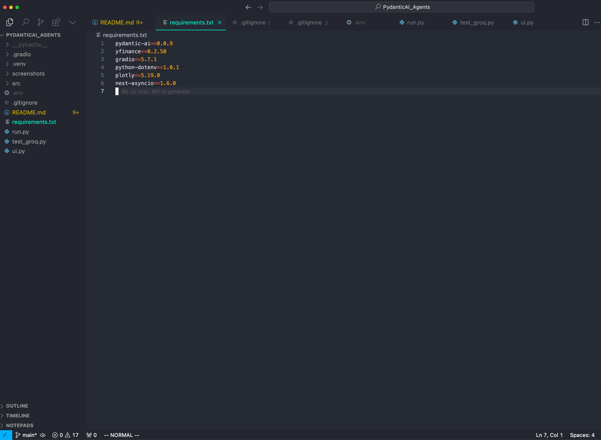
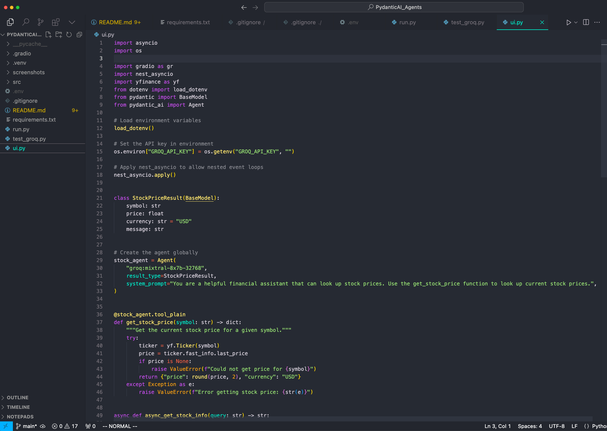
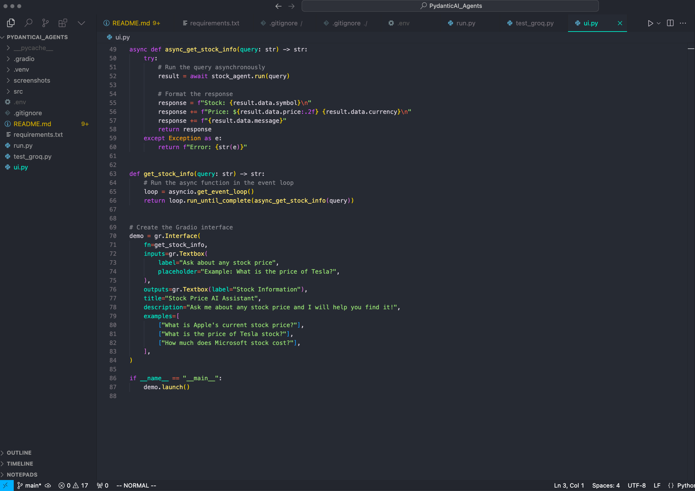
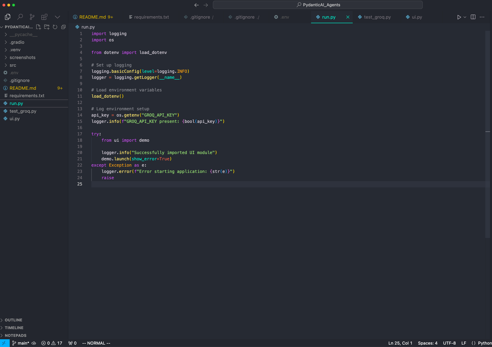
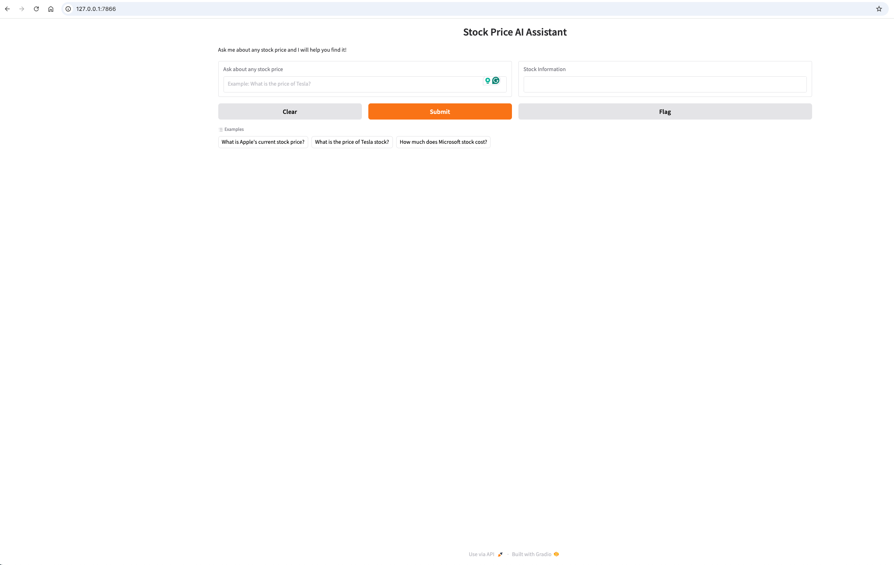
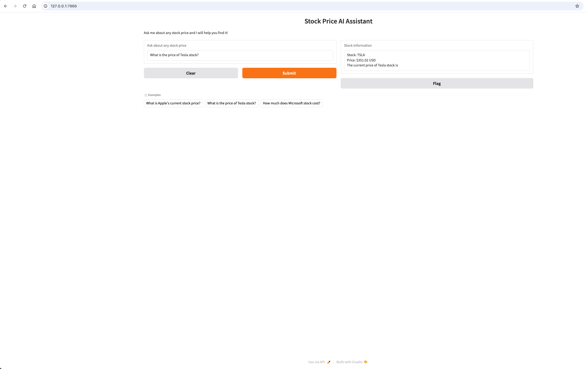

# PydanticAI Stock Price Assistant

## Description
A Python-based financial analysis tool that leverages the Yahoo Finance API (yfinance) to fetch and analyze stock market data. The project features an interactive web interface built with Gradio, allowing users to easily visualize and analyze financial data through interactive plots powered by Plotly. The application utilizes Pydantic for robust data validation and schema enforcement, ensuring data integrity throughout the analysis pipeline and providing type-safe data structures for financial metrics.

## Features
- Real-time stock data fetching using yfinance
- Interactive web interface for data visualization
- Dynamic financial charts and graphs
- Secure environment variable management
- Asynchronous data processing capabilities

## Technologies Used
- Python
- Gradio (Web Interface)
- YFinance (Financial Data API)
- Plotly (Data Visualization)
- Pydantic (Data Validation)
- Python-dotenv (Environment Management)

## Skills Learned
- Advanced understanding of API integration and financial data processing
- Proficiency in building interactive web interfaces using Gradio
- Expertise in data validation and type safety using Pydantic
- Implementation of asynchronous programming patterns in Python
- Development of secure practices for handling API keys and sensitive data
- Experience with real-time data fetching and processing

## Tools Used
- Visual Studio Code for development
- Git and GitHub for version control
- Groq API for AI-powered natural language processing
- Yahoo Finance API for real-time stock data
- Gradio framework for web interface development
- Python's asyncio library for asynchronous operations

## Project Implementation

### 1. Project Setup

The project requires several dependencies and proper environment configuration. The `requirements.txt` file lists all necessary packages, and the `.env` file manages sensitive API keys securely.

### 2. Core Implementation

The core functionality is implemented in `ui.py`, which includes:
- Stock price data model using Pydantic
- AI agent configuration for natural language processing
- Real-time stock data fetching functionality

### 3. Application Initialization

The `run.py` file handles:
- Environment variable loading
- Logging configuration
- Application startup and error handling

### 4. User Interface

The clean, user-friendly interface allows users to:
- Input natural language queries about stock prices
- View example queries for guidance
- Clear input and reset the interface

### 5. Query Results

When querying stock prices, the interface displays:
- Current stock price and symbol
- AI-generated response explaining the data
- Additional context about the query

## Installation
1. Clone the repository
2. Install dependencies: `pip install -r requirements.txt`
3. Set up your environment variables in `.env` file
4. Run the application: `python run.py`
